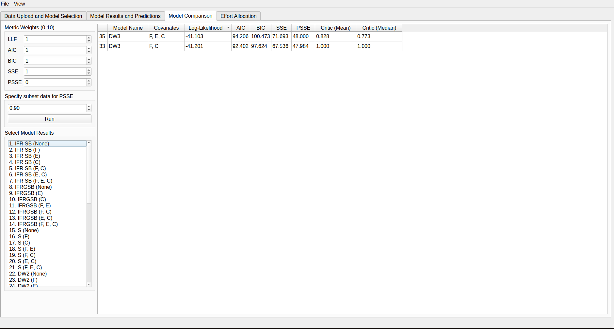
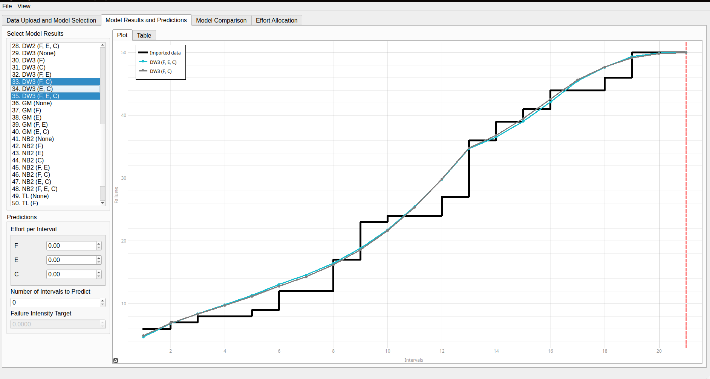
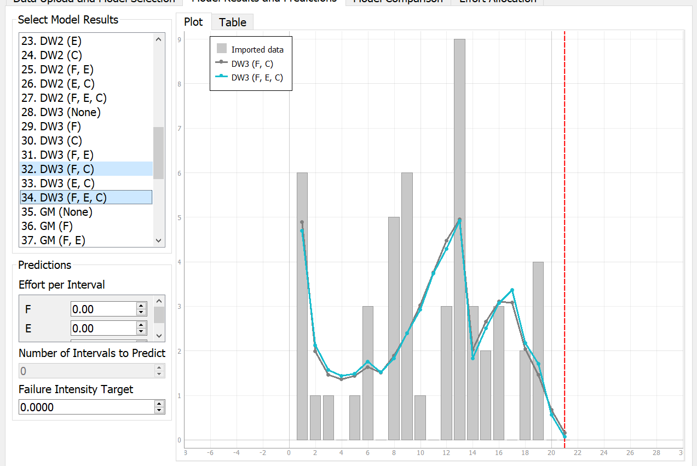
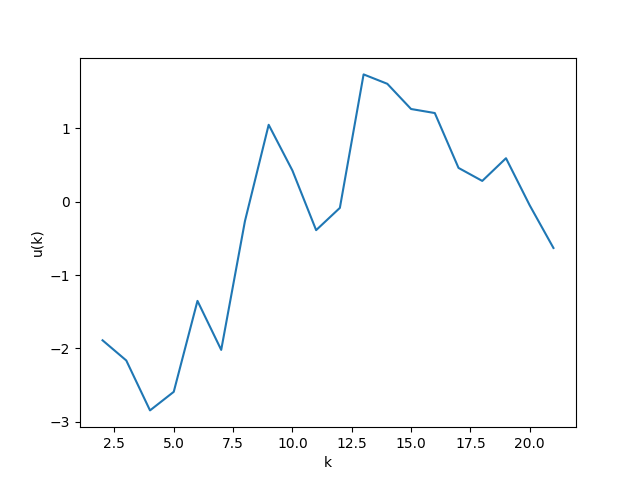
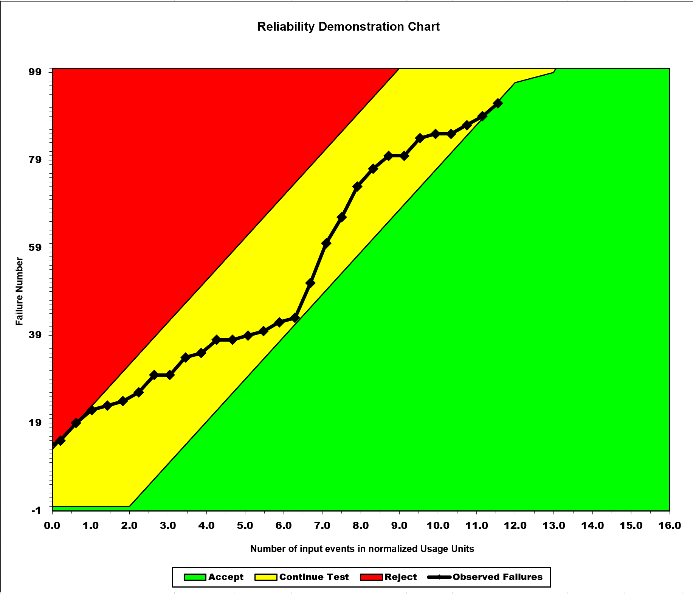
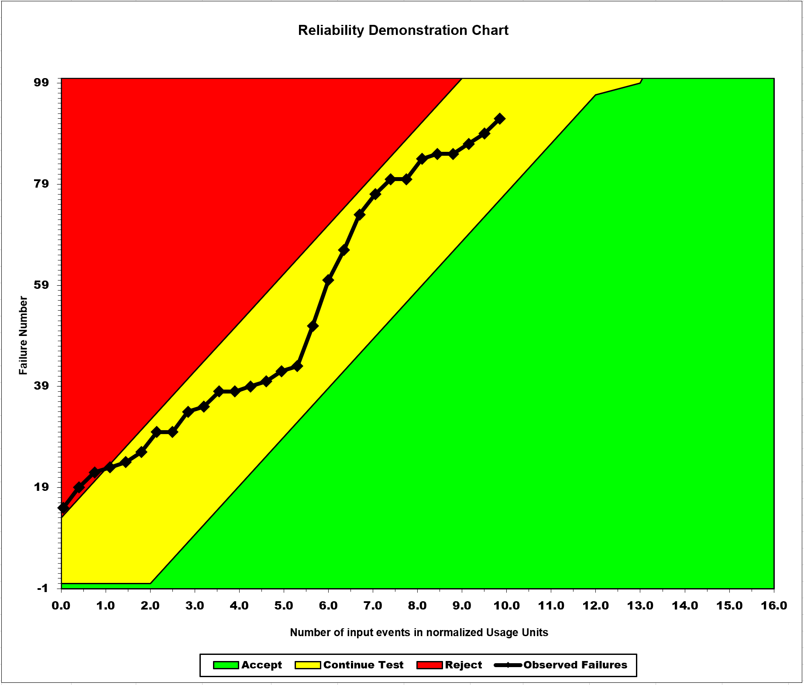
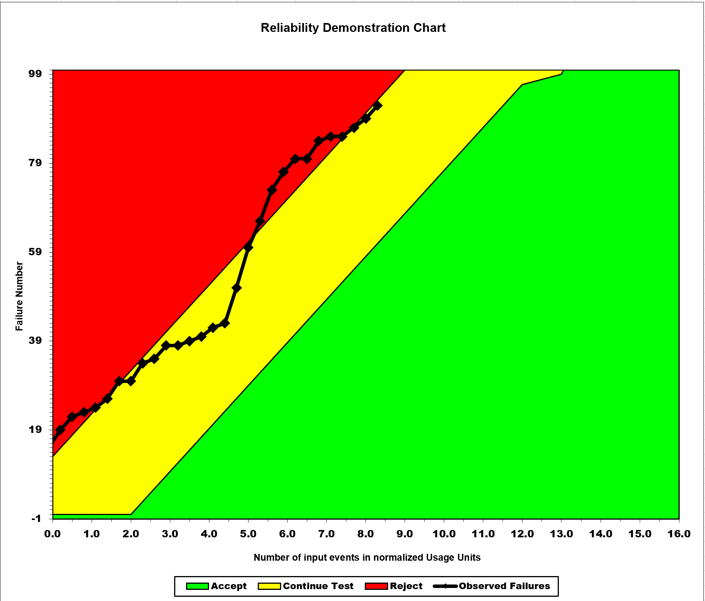
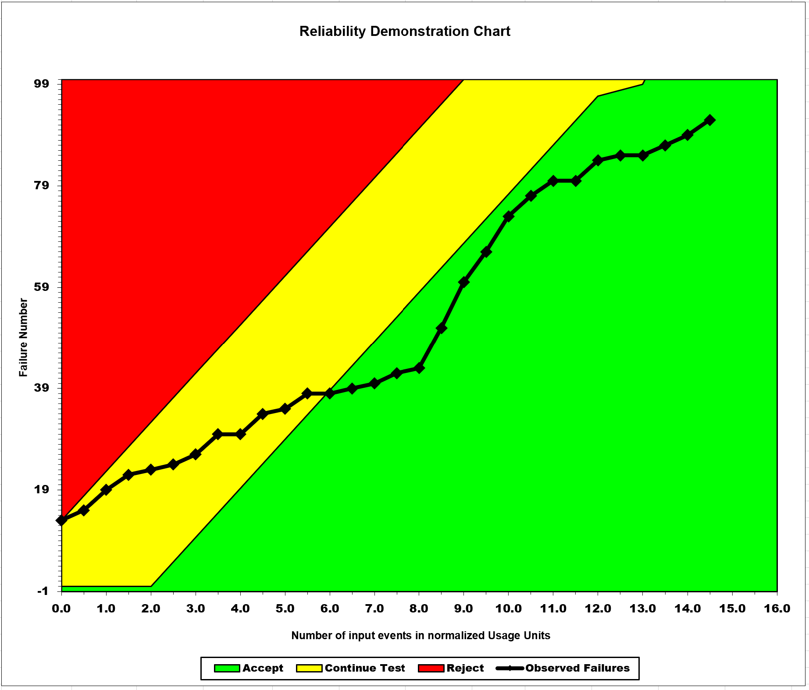

**SENG 438- Software Testing, Reliability, and Quality**

**Lab. Report \#5 – Software Reliability Assessment**

| Group \#: 18      |
|-------------------|
| Student Names:  	|
|  Braden Foley     |
|  Ethan Sengsavang |
|  Momin Ali Khan   |
|  Nicole Zacaruk   |

# Introduction
In this assignment, we were eager to gain hands-on experience in assessing software reliability for a
hypothetical system using failure data collected during integration testing. By working with reliability assessment
tools such as START or C-SFRAT for reliability growth testing and the Reliability Demonstration Chart (RDC) for
reliability assessment, we had aimed to enhance our understanding of reliability growth testing and its significance in
software development, while also learning to measure failure rate, Mean Time To Failure (MTTF), and system reliability
through data analysis.

# Assessment Using Reliability Growth Testing 

The folowing are the reliability results and plots using the C-SFRAT tool.

## Model Comparison and Failure Rate and Reliability Plots
Our top two models were determined to be DW3(F,C) and
DW3(F,E,C) which was revealed by sorting by the greatest Log-Likelihood in C-STRAT. Figure 1 shows the the
log-likelihood values, which are -41.103 and -41.201, the highest values.

Figure 1. Model ranking

Below are the MVF graph and failure intesnsity graphs including the best fit models DW3(F,C) and DW3(F,E,C).

Figure 2. MVF graph with the 2 best models

Fig 2 shows cumulitive failures over all intervals and visibly begins to plato at the final intervals. When we added
predicitve data using the C-SFRAT tool the graph out in a horizontal line confirming the plato in the results. This
indicates increased reliability.

Figure 3. Intensity graph with 2 best models

Fig 3 also shows a steady decline in the intensity of failures occuring in the final intervals.

## Range Analysis

We plotted the Laplace trend (as seen in figure 4) and upon analysis determined the valid range to be from [6,21]
given that u(k) is between 2 and -2 throughout that range, indicating stable reliability. The sections where u(k) is
greater than +2 it's considered reliability decrease while values less than -2 are considered reliability increase.
While our Laplace range does have a section of reliability increase from aproximatly [0,6], there's no instance where
u(k) reaches a value greater than +2.

Figure 4. Laplace Trend Graph

# Assessment Using Reliability Demonstration Chart

In evaluating the hypothetical System Under Test, we utilized the provided RDC Excel spreadsheet. We replaced the
demonstration data with the given data points, merging time intervals in pairs and aggregating the errors detected at
each interval. This enabled us to establish the minimum acceptable threshold for system errors based on the acceptable
ranges.

The system is considered acceptable at the point when a maximum of 81 errors are detected over 200 input events. To
explore different MTTFs, we varied the maximum acceptable errors or the input event intervals by either increasing or
decreasing their values.

### Minimum MTTF

### Middle MTTF

### Higher MTTF

### Lower MTTF

### Evaluation and justification for the plots and pros/cons of RDC 

The plots clearly show that as the acceptable number of failures increases, the program becomes more suitable for use,
while a decrease in MTTF leads to the rejection of the program due to the number of failures occurring during runtime.
This is logical since MTTF is a measure of the total time a system operates divided by the number of failures or
defects.

To determine the minimum MTTF, we experimented with various MTTF values, finding the plot where the final failure data
barely entered the acceptable plot range.

Using RDC to assess the reliability of an SUT offers several advantages, such as enabling both customers and developers
to establish an acceptable failure rate for the system. RDC facilitates easy visualization of failure data in comparison
to acceptable and rejectable failure targets. Moreover, RDC is a quick and cost-efficient method for evaluating an SUT's
reliability once users become familiar with the tools. However, one drawback observed in this lab is that determining
the MTTF minimum entails some educated guesswork. Nevertheless, the chart's visualization aids in approximating the MTTF
minimum, even if it can be laborious. Additionally, RDC displays reliability in terms of trends and relativity rather
than providing a precise quantitative value.

A disadvantage of RDC is that exploring various what-if scenarios by testing different values can be time-consuming.
While the RDC illustrates the impact of trend changes on system reliability, it does not offer definitive quantitative
values for reliability. On the other hand, the advantages of using RDC include its ease of analysis and data input. The
ability to examine numerous what-if scenarios is also beneficial.

# Comparison of Results

RGT and RDC are both commonly used reliability testing methods that can help developers and customers alike decide
whether or not a software system has stabilized to an acceptable failure rate. 

Through analyzing our Reliability Growth Testing, our graph begins to plateau after a longer period of time of testing
has occurred. This plateau suggests that the system is beginning to stabilize based on the given input data and the
frequency of failures will begin to significantly diminish.

We can observe a similar trend in our Reliability Demonstration Chart. Although this method of reliability testing
focuses on differing failure metrics, it is evident that over time, based on the Mean Time to Failure (MTTFmin), the
system does enter the acceptable range of reliability. A benefit of this method over RGT is that it is more explicit in
whether a system meets our requirements for the reliability, helping the developers and customers make a more informed
decision on whether to continuing testing or not.

# Discussion on Similarity and Differences of the Two Techniques

## Similarities

Both the Reliability Growth Testing and the Reliability Demonstration Chart use failure time intervals or failure count
to calculate properties of the system which can be used to determine whether the system is reliable. Either technique
graphically plots the number of cumulative failures with respect to some measure of time. Although the data in either
case is discrete, the trend of these datapoints are considered when determining system reliability.

## Differences

The Reliability Growth Testing method aims to determine the overall trend at which bugs are found during testing. Using
a greater number of failure data than what can be used within the Reliability Demonstration Chart, the failure data can
be plotted and compared to several different mathematical models to estimate how many failures can be seen in the
future. This starts with the calculation of different models to see potential candidates to which model the data
follows, followed by an analysis of shared properties of those models with respect to the data to determine a line of
best fit. This modelling and estimation is not found within the Reliability Demonstration Chart. This alterate method
uses client and developer-specified metrics to determine when the system is deemed "reliable enough" to be used within
production. These metrics help define three distinct regions within a cartesian plane, which distinguishes whether the
software can be accepted, rejected or requires further testing. Now, as issues are detected, the number of cumulative
failures can be plotted on this graph with respect to when that failure occurred. As a result, it can be seen which
range the newest data point falls into, informing both the client and the developers that the system is satisfactory.

# How the team work/effort was divided and managed

The task was evenly distributed between two groups. The first group focused on Part 2, obtaining results for Reliability
Growth Testing (RGT), while the second group was responsible for acquiring and documenting the results for the
Reliability Demonstration Chart (RDC). Our primary challenge was managing multiple deadlines concurrently, necessitating
efficient time management to complete the assignment punctually.

# Difficulties encountered, challenges overcome, and lessons learned

Throughout the assignment, we faced several difficulties such as understanding the intricacies of the reliability
assessment tools and ensuring accurate interpretation of the results.

Understanding the reliability assessment tools: Initially, comprehending the inner workings of the START, C-SFRAT, and
RDC tools was a challenge. However, as we immersed ourselves in the documentation and experimented with various inputs,
our understanding improved, and we became more proficient in using the tools.

Through overcoming these challenges, we learned valuable lessons, including the importance of effective communication
and collaboration within the team and the value of persistence when faced with complex tools and concepts. These lessons
will undoubtedly prove useful in future academic and professional endeavors.

# Comments/feedback on the lab itself

We recommend that latest softwares and technologies be used and thus allowed to converse with in order to improve the
experential learning aspect of this lab and hence, this course.
